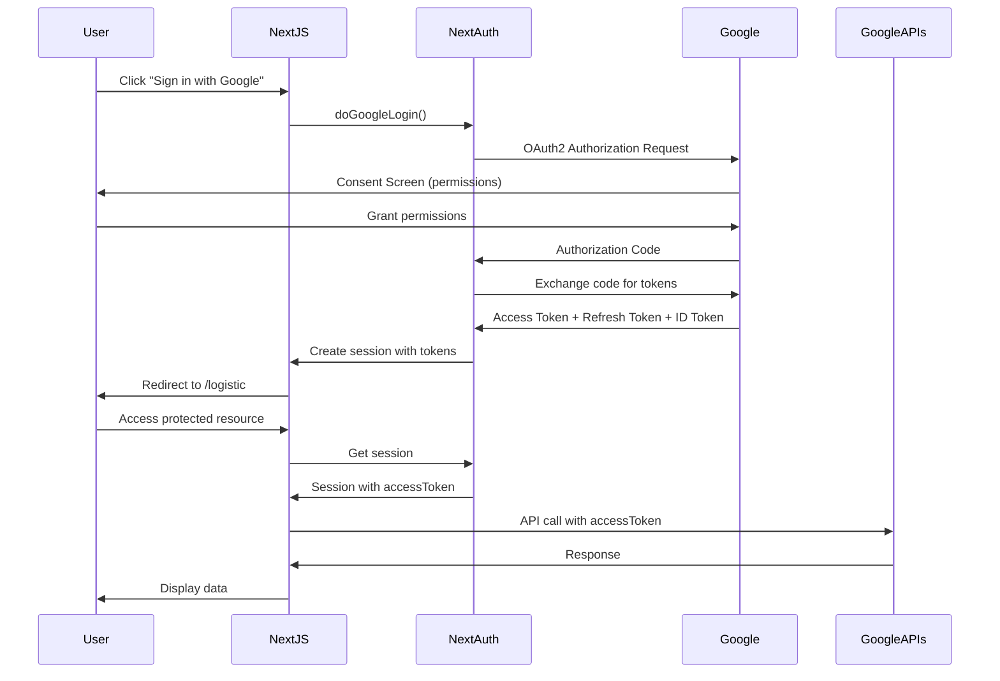

# Google Authentication Implementation Guide

## Overview

Home Logistics uses **NextAuth.js v5 (beta)** with the Google OAuth 2.0 provider to authenticate users and obtain access tokens for Google Drive, Google Sheets, and Gmail APIs.

## Table of Contents

1. [Architecture](#architecture)
2. [Setup Requirements](#setup-requirements)
3. [Google Cloud Console Configuration](#google-cloud-console-configuration)
4. [Implementation Details](#implementation-details)
5. [Authentication Flow](#authentication-flow)
6. [Token Management](#token-management)
7. [Using Authentication in the App](#using-authentication-in-the-app)
8. [Troubleshooting](#troubleshooting)

---

## Architecture



## Setup Requirements

### Prerequisites

- Google Account
- Google Cloud Project
- Next.js application (this project)
- Node.js >= 18.0.0

### Environment Variables

Create a `.env.local` file in the root directory with the following variables:

```env
# NextAuth Configuration
AUTH_SECRET=your-random-secret-here

# Google OAuth Credentials
AUTH_GOOGLE_ID=your-google-client-id.apps.googleusercontent.com
AUTH_GOOGLE_SECRET=your-google-client-secret
```

**Generate AUTH_SECRET:**

```bash
openssl rand -base64 32
```

---

## Google Cloud Console Configuration

### Step 1: Create a Google Cloud Project

1. Go to [Google Cloud Console](https://console.cloud.google.com/)
2. Click **"Select a project"** → **"New Project"**
3. Enter project name (e.g., "Home Logistics")
4. Click **"Create"**

### Step 2: Enable Required APIs

1. In the Google Cloud Console, navigate to **"APIs & Services"** → **"Library"**
2. Enable the following APIs:
   - **Google Drive API**
   - **Google Sheets API**
   - **Gmail API**

### Step 3: Configure OAuth Consent Screen

1. Go to **"APIs & Services"** → **"OAuth consent screen"**
2. Select **"External"** user type (or "Internal" if using Google Workspace)
3. Click **"Create"**

#### Fill in OAuth Consent Screen Details:

**App Information:**

- **App name**: Home Logistics
- **User support email**: Your email
- **App logo**: (Optional)

**App Domain:**

- **Application home page**: `http://localhost:2020` (development)
- **Authorized domains**: Your production domain (when deploying)

**Developer contact information:**

- Your email address

4. Click **"Save and Continue"**

#### Add Scopes:

1. Click **"Add or Remove Scopes"**
2. Add the following scopes:

   - `.../auth/userinfo.email`
   - `.../auth/userinfo.profile`
   - `openid`
   - `https://www.googleapis.com/auth/drive`
   - `https://www.googleapis.com/auth/gmail.send`

3. Click **"Update"** → **"Save and Continue"**

#### Test Users (if using External):

1. Add your email as a test user
2. Click **"Save and Continue"**

### Step 4: Create OAuth 2.0 Credentials

1. Go to **"APIs & Services"** → **"Credentials"**
2. Click **"Create Credentials"** → **"OAuth client ID"**
3. Select **"Web application"**

**Configure the OAuth Client:**

- **Name**: Home Logistics Web Client
- **Authorized JavaScript origins**:

  - `http://localhost:2020` (development)
  - `https://your-domain.com` (production)

- **Authorized redirect URIs**:
  - `http://localhost:2020/api/auth/callback/google` (development)
  - `https://your-domain.com/api/auth/callback/google` (production)

4. Click **"Create"**
5. Copy the **Client ID** and **Client Secret**

### Step 5: Update Environment Variables

Add the credentials to your `.env.local` file:

```env
AUTH_GOOGLE_ID=your-client-id.apps.googleusercontent.com
AUTH_GOOGLE_SECRET=your-client-secret
```

---

## Implementation Details

### 1. NextAuth Configuration (`auth.ts`)

```typescript
import NextAuth from "next-auth";
import Google from "next-auth/providers/google";

export const {
  handlers: { GET, POST },
  signIn,
  signOut,
  auth,
} = NextAuth({
  providers: [
    Google({
      authorization: {
        params: {
          prompt: "consent", // Always show consent screen
          access_type: "offline", // Get refresh token
          response_type: "code", // Authorization code flow
          scope:
            "openid email profile " +
            "https://www.googleapis.com/auth/drive " +
            "https://www.googleapis.com/auth/gmail.send",
        },
      },
    }),
  ],
  callbacks: {
    // Store tokens in JWT
    async jwt({ token, account }) {
      if (account) {
        token.accessToken = account.access_token;
        token.refreshToken = account.refresh_token;
        token.idToken = account.id_token;
      }
      return token;
    },
    // Add tokens to session
    async session({ session, token }) {
      session.accessToken = token.accessToken;
      token.refreshToken = token.refreshToken;
      session.idToken = token.idToken;
      return session;
    },
  },
});
```

**Key Configuration Options:**

- **`prompt: "consent"`**: Forces Google to show the consent screen every time, ensuring we always get a refresh token
- **`access_type: "offline"`**: Requests a refresh token for long-term access
- **`response_type: "code"`**: Uses authorization code flow (most secure)
- **Custom scopes**: Requests access to Drive and Gmail in addition to basic profile

### 2. NextAuth Type Extensions (`next-auth.d.ts`)

```typescript
import NextAuth, { DefaultSession } from "next-auth";
import { JWT } from "next-auth/jwt";

declare module "next-auth" {
  interface Session {
    accessToken?: string;
    idToken?: string;
  }
}

declare module "next-auth/jwt" {
  interface JWT {
    accessToken?: string;
    refreshToken?: string;
    idToken?: string;
  }
}
```

This extends NextAuth types to include our custom token fields.

### 3. API Route Handler (`app/api/auth/[...nextauth]/route.ts`)

```typescript
export { GET, POST } from "../../../../auth";
```

This exports the NextAuth handlers for the API route.

### 4. Authentication Actions (`app/actions/authenticate.js`)

```typescript
"use server";
import { signIn, signOut } from "../../auth";

export async function doGoogleLogin() {
  await signIn("google", { redirectTo: "/logistic" });
}

export async function doGoogleLogout() {
  await signOut("google");
}
```

Server actions that trigger sign in and sign out.

### 5. Session Authentication Helper (`app/lib/googleSessionAuth.ts`)

```typescript
"use server";
import { auth } from "../../auth";

export async function googleSessionAuth() {
  const session = await auth();
  if (!session) {
    throw new Error("There are problems with user authentication");
  }
  const accessToken = session.accessToken;
  if (!accessToken) {
    throw new Error("Could not obtain accessToken.");
  }
  return { session, accessToken };
}
```

Utility function to validate session and extract access token.

### 6. UI Authentication Component (`app/ui/authenticate.tsx`)

```typescript
import { doGoogleLogin } from "../actions/authenticate";

export function Authenticate() {
  return (
    <form action={doGoogleLogin}>
      <button type="submit">Signin with Google</button>
    </form>
  );
}
```

Simple form that triggers Google OAuth flow.

---

## Authentication Flow

### 1. Initial Sign-In

```
User clicks "Sign in with Google"
  ↓
doGoogleLogin() called
  ↓
NextAuth initiates OAuth flow
  ↓
User redirected to Google
  ↓
User grants permissions
  ↓
Google redirects back with authorization code
  ↓
NextAuth exchanges code for tokens:
  - access_token (1 hour expiry)
  - refresh_token (long-lived)
  - id_token (JWT with user info)
  ↓
Tokens stored in JWT session cookie
  ↓
User redirected to /logistic
```

### 2. Accessing Protected Resources

```
User navigates to protected page
  ↓
Server component/action calls googleSessionAuth()
  ↓
Retrieves session from cookie
  ↓
Extracts accessToken from session
  ↓
Makes API call to Google with accessToken
  ↓
Returns data to user
```

---

## Token Management

### Access Tokens

- **Lifetime**: 1 hour
- **Storage**: Server-side JWT cookie (encrypted)
- **Usage**: Passed in `Authorization: Bearer {token}` header for Google API calls
- **Security**: Never exposed to client-side code

### Refresh Tokens

- **Lifetime**: Long-lived (months/years or until revoked)
- **Storage**: Server-side JWT cookie
- **Usage**: Automatically used by NextAuth to obtain new access tokens (currently not fully implemented)
- **Security**: Stored securely, never sent to client

### ID Tokens

- **Purpose**: Contains user profile information
- **Usage**: User identification, not API authorization
- **Format**: JWT with claims (email, name, picture, etc.)

### Token Refresh Strategy

**Current Implementation:**

- Access tokens obtained during sign-in
- Valid for 1 hour

**Future Enhancement Needed:**

- Implement automatic token refresh when access token expires
- Use refresh token to get new access token
- Handle token expiry gracefully

**Recommended Implementation:**

```typescript
async function getValidAccessToken() {
  const session = await auth();

  // Check if access token is expired
  if (isTokenExpired(session.accessToken)) {
    // Use refresh token to get new access token
    const newTokens = await refreshAccessToken(session.refreshToken);
    // Update session with new tokens
    await updateSession(newTokens);
    return newTokens.accessToken;
  }

  return session.accessToken;
}
```

---

## Using Authentication in the App

### In Server Components

```typescript
import { auth } from "@/auth";

export default async function MyPage() {
  const session = await auth();

  if (!session) {
    redirect("/");
  }

  return <div>Welcome {session.user.name}</div>;
}
```

### In Server Actions

```typescript
"use server";
import { googleSessionAuth } from "@/app/lib/googleSessionAuth";

export async function myServerAction() {
  const { session, accessToken } = await googleSessionAuth();

  // Use accessToken for Google API calls
  const response = await fetch("https://www.googleapis.com/drive/v3/files", {
    headers: {
      Authorization: `Bearer ${accessToken}`,
    },
  });

  return response.json();
}
```

### Making Google API Calls

#### Google Drive API Example

```typescript
import { googleSessionAuth } from "@/app/lib/googleSessionAuth";

export async function listFiles() {
  const { accessToken } = await googleSessionAuth();

  const response = await fetch("https://www.googleapis.com/drive/v3/files", {
    method: "GET",
    headers: {
      Authorization: `Bearer ${accessToken}`,
      "Content-Type": "application/json",
    },
  });

  if (!response.ok) {
    throw new Error("Failed to fetch files");
  }

  return response.json();
}
```

#### Google Sheets API Example

```typescript
import { GoogleSpreadsheet } from "google-spreadsheet";
import { OAuth2Client } from "google-auth-library";
import { googleSessionAuth } from "@/app/lib/googleSessionAuth";

export async function getSpreadsheet(spreadsheetId: string) {
  const { accessToken } = await googleSessionAuth();

  // Create OAuth2 client
  const authClient = new OAuth2Client();
  authClient.setCredentials({ access_token: accessToken });

  // Create spreadsheet instance
  const doc = new GoogleSpreadsheet(spreadsheetId, authClient);
  await doc.loadInfo();

  return doc;
}
```

#### Gmail API Example

```typescript
import { googleSessionAuth } from "@/app/lib/googleSessionAuth";

export async function sendEmail(to: string, subject: string, body: string) {
  const { accessToken } = await googleSessionAuth();

  const email = [`To: ${to}`, `Subject: ${subject}`, "", body].join("\n");

  const encodedEmail = Buffer.from(email)
    .toString("base64")
    .replace(/\+/g, "-")
    .replace(/\//g, "_")
    .replace(/=+$/, "");

  const response = await fetch(
    "https://gmail.googleapis.com/gmail/v1/users/me/messages/send",
    {
      method: "POST",
      headers: {
        Authorization: `Bearer ${accessToken}`,
        "Content-Type": "application/json",
      },
      body: JSON.stringify({ raw: encodedEmail }),
    }
  );

  return response.json();
}
```

---

## Troubleshooting

### Common Issues

#### 1. "Error 400: redirect_uri_mismatch"

**Cause**: The redirect URI in your request doesn't match the authorized URIs in Google Cloud Console.

**Solution**:

- Verify the redirect URI in Google Cloud Console matches exactly:
  - Development: `http://localhost:2020/api/auth/callback/google` (port 2020)
  - Production: `https://yourdomain.com/api/auth/callback/google`
- No trailing slashes
- Check protocol (http vs https)

#### 2. "Invalid credentials" or "Could not obtain accessToken"

**Cause**: Missing or incorrect environment variables.

**Solution**:

- Verify `.env.local` has correct values
- Restart development server after changing env variables
- Check that `AUTH_GOOGLE_ID` and `AUTH_GOOGLE_SECRET` match Google Cloud Console

#### 3. "Access blocked: This app's request is invalid"

**Cause**: OAuth consent screen not configured properly or scopes not approved.

**Solution**:

- Complete OAuth consent screen configuration
- Add all required scopes
- Add yourself as a test user (for external apps)
- Verify app is not marked as "Needs verification"

#### 4. No refresh token received

**Cause**: User has already granted permissions; Google only provides refresh token on first authorization.

**Solution**:

- Revoke access at https://myaccount.google.com/permissions
- Sign in again
- Ensure `prompt: "consent"` is in OAuth configuration

#### 5. "Error 403: Access Not Configured"

**Cause**: Required Google APIs not enabled in Google Cloud Console.

**Solution**:

- Enable Google Drive API
- Enable Google Sheets API
- Enable Gmail API (if using email features)

#### 6. Token expired errors

**Cause**: Access token has expired (1-hour lifetime).

**Solution** (Temporary):

- Sign out and sign in again

**Solution** (Permanent):

- Implement token refresh logic using refresh token

### Debug Tips

#### 1. Check session contents

```typescript
const session = await auth();
console.log("Session:", JSON.stringify(session, null, 2));
```

#### 2. Verify token in JWT

Use [jwt.io](https://jwt.io) to decode and inspect JWT tokens.

#### 3. Test API access directly

```bash
# Test Drive API
curl -H "Authorization: Bearer YOUR_ACCESS_TOKEN" \
  https://www.googleapis.com/drive/v3/files

# Test Gmail API
curl -H "Authorization: Bearer YOUR_ACCESS_TOKEN" \
  https://gmail.googleapis.com/gmail/v1/users/me/profile
```

#### 4. Enable debug logging

```typescript
// In auth.ts
export const { ... } = NextAuth({
  debug: true,  // Enable debug logging
  ...
});
```

---

## Security Best Practices

### 1. Environment Variables

- ✅ Never commit `.env.local` to version control
- ✅ Use different OAuth clients for development and production
- ✅ Rotate `AUTH_SECRET` periodically in production

### 2. OAuth Configuration

- ✅ Use `authorization code flow` (not implicit flow)
- ✅ Request only necessary scopes
- ✅ Implement PKCE (handled by NextAuth)

### 3. Token Storage

- ✅ Store tokens server-side only
- ✅ Never expose access tokens to client JavaScript
- ✅ Use encrypted JWT cookies (handled by NextAuth)

### 4. API Calls

- ✅ All Google API calls made from server-side code
- ✅ Validate session before every API call
- ✅ Handle token expiry gracefully

### 5. Production Considerations

- ✅ Use HTTPS in production
- ✅ Set secure cookie flags
- ✅ Implement rate limiting
- ✅ Monitor for unauthorized access attempts
- ✅ Regular security audits

---

## Additional Resources

- [NextAuth.js Documentation](https://next-auth.js.org/)
- [Google OAuth 2.0 Documentation](https://developers.google.com/identity/protocols/oauth2)
- [Google Drive API Reference](https://developers.google.com/drive/api/v3/reference)
- [Google Sheets API Reference](https://developers.google.com/sheets/api/reference/rest)
- [Gmail API Reference](https://developers.google.com/gmail/api/reference/rest)

---

## Summary

Home Logistics implements a secure, server-side Google authentication flow using NextAuth.js v5. The implementation:

1. ✅ Uses OAuth 2.0 authorization code flow
2. ✅ Obtains offline access via refresh tokens
3. ✅ Stores tokens securely in encrypted JWT cookies
4. ✅ Makes all API calls server-side
5. ✅ Never exposes credentials to client
6. ✅ Requests appropriate scopes for Drive, Sheets, and Gmail

The system is production-ready with the addition of automatic token refresh handling for long-running sessions.
